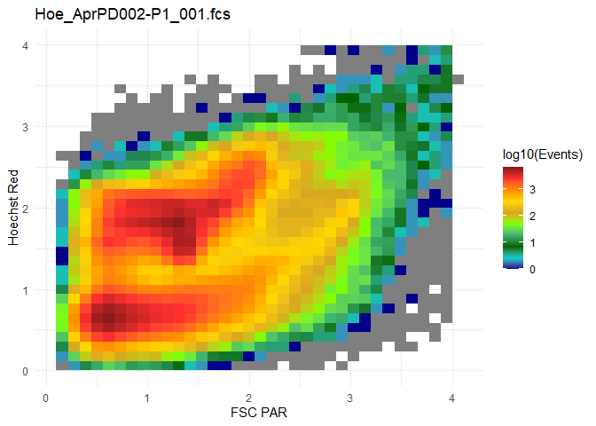
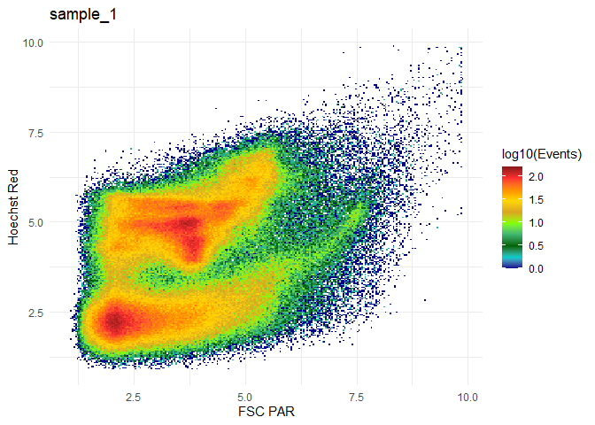
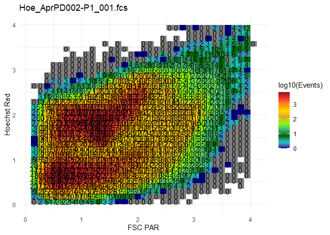
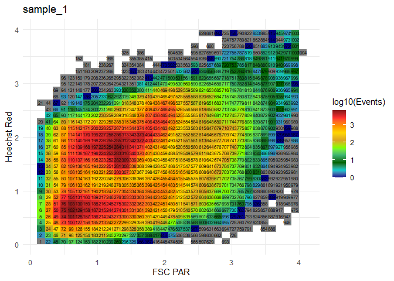

-   [FlowSoFine](#flowsofine)
    -   [Installation](#installation)
    -   [Quickstart](#quickstart)
    -   [Plotting](#plotting)
    -   [T-Scores](#t-scores)
    -   [Additional statistical output (adonis2,
        NMDS)](#additional-statistical-output-adonis2-nmds)
    -   [Multidimensional analysis](#multidimensional-analysis)
        -   [Creating and converting higher dimensional
            FSFTemplates](#creating-and-converting-higher-dimensional-fsftemplates)
        -   [Plotting with less or more than two
            channels](#plotting-with-less-or-more-than-two-channels)
        -   [Analysing single channels](#analysing-single-channels)

<!-- README.md is generated from README.Rmd. Please edit that file -->

# FlowSoFine

<!-- badges: start -->
<!-- badges: end -->

The goal of FlowSoFine is to quickly and easily generate data structures
that make it easy to get statistical output starting from raw fcs-files
and a metadata table. The grid approach is especially useful if there
aren’t any populations clearly visible in the files. This works with a
flexible number of channels and correction for spatial dependencies.

## Installation

You can install the development version of FlowSoFine from GitHub with:

``` r
library(devtools)
install_github("JonasKup/FlowSoFine")
```

## Quickstart

This is a basic example which shows you how to solve a common problem:

``` r
library(FlowSoFine)
setwd("C:/Users/jonas/Documents/IUF/FACSDATA/testExp/fcs")


#for reading fcs files. Installation via Bioconductor. https://www.bioconductor.org/packages/release/bioc/html/flowCore.html
library(flowCore)

fcs <- read.flowSet(pattern = ".fcs")
metadata <- read.csv2("metadata.csv")

#Create the FSFTemplate
template <- FSFTemplate(flowset = fcs, channels = c("FSC PAR", "Hoechst Red"), resolution = 35)
#> Transforming and subsetting flowSet
#> Building coordinates for FSFtemplate with 2 dimensions and a resolution of 35 
#>  Processing sample 1 / 14 Processing sample 2 / 14 Processing sample 3 / 14 Processing sample 4 / 14 Processing sample 5 / 14 Processing sample 6 / 14 Processing sample 7 / 14 Processing sample 8 / 14 Processing sample 9 / 14 Processing sample 10 / 14 Processing sample 11 / 14 Processing sample 12 / 14 Processing sample 13 / 14 Processing sample 14 / 14

#plot the first sample of the FSFTemplate
plot(template = template, sample = 1)
```



``` r

#Create a distance matrix with adjustments for spatial dependencies
distM <- weightedBray(template)


#for community ecology statistics
library(vegan)
#> Loading required package: permute
#> Loading required package: lattice
#> This is vegan 2.5-6

#You can use the adonis2 function from the vegan package to get statistical output
adonis2(distM ~ treatment + age, data = metadata)
#> Permutation test for adonis under reduced model
#> Terms added sequentially (first to last)
#> Permutation: free
#> Number of permutations: 999
#> 
#> adonis2(formula = distM ~ treatment + age, data = metadata)
#>           Df SumOfSqs      R2      F Pr(>F)
#> treatment  1  0.09713 0.07966 0.8612  0.609
#> age       10  0.89666 0.73536 0.7950  0.859
#> Residual   2  0.22556 0.18499              
#> Total     13  1.21935 1.00000
```

## Plotting

``` r
#plot a flowCore flowFrame with a flexible resolution and transformation function
plotFF(flowFrame = fcs[[1]], channels = c("FSC PAR", "Hoechst Red"), resolution = 250, transformation = asinh)
```



``` r

#plot the first sample of the above created FSFTemplate
plot(template, sample = 1)
```


``` r
#add info to the plot using the ggplot2 library
library(ggplot2)
#add tbe total number of events in each bin for sample 1 to the plot
plot(template, sample = 1) + geom_text(aes(label = template@counts[,1]))
```



``` r
#add the bin number to each bin
plot(template, sample = 1) + geom_text(aes(label = 1:template@nBins))
```



## T-Scores

## Additional statistical output (adonis2, NMDS)

## Multidimensional analysis

### Creating and converting higher dimensional FSFTemplates

### Plotting with less or more than two channels

### Analysing single channels
