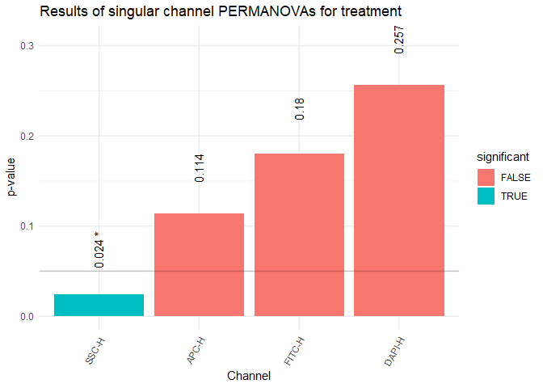

-   [FlowSoFine](#flowsofine)
    -   [Installation](#installation)
    -   [Graphical User Interface](#graphical-user-interface)
    -   [Quick Start](#quick-start)
        -   [Reading Files and Metadata](#reading-files-and-metadata)
        -   [Creating the FSFTemplate](#creating-the-fsftemplate)
        -   [Creating the Distance
            Matrix](#creating-the-distance-matrix)
        -   [nmds-plot](#nmds-plot)
        -   [Analysis of Variance using
            ADONIS](#analysis-of-variance-using-adonis)
        -   [Detection of driving features with
            t-scores](#detection-of-driving-features-with-t-scores)
    -   [FSFTemplate](#fsftemplate)
    -   [Plotting](#plotting)
    -   [Weights and Distance Matrices](#weights-and-distance-matrices)
        -   [Distance Matrix without adjustments for spatial
            dependencies](#distance-matrix-without-adjustments-for-spatial-dependencies)
        -   [The weightedBray function](#the-weightedbray-function)
        -   [Custom Weight Matrices](#custom-weight-matrices)
        -   [Visualizing Weight Matrices](#visualizing-weight-matrices)
    -   [Multidimensional analysis](#multidimensional-analysis)
        -   [Creating and converting higher dimensional
            FSFTemplates](#creating-and-converting-higher-dimensional-fsftemplates)
        -   [Plotting with less or more than two
            channels](#plotting-with-less-or-more-than-two-channels)
        -   [Analysing single channels](#analysing-single-channels)

<!-- README.md is generated from README.Rmd. Please edit that file -->
<!-- knitr::knit("README.Rmd") -->

# FlowSoFine

<!-- badges: start -->
<!-- badges: end -->

The goal of FlowSoFine is to quickly and easily generate data structures
that make it easy to get statistical output starting from raw fcs-files
and a metadata table. The grid approach is especially useful if there
aren’t any populations clearly visible in the files. This works with a
flexible number of channels and correction for spatial dependencies.

## Installation

You can install the development version of FlowSoFine from GitHub with:

``` r
install.packages("remotes")
remotes::install_github("JonasKup/FlowSoFine")
```

## Graphical User Interface

A graphical user interface for the method is available here:
<https://github.com/JonasKup/FlowSoFineApp>

## Quick Start

### Reading Files and Metadata

First read the fcs-files and the metadata table.

``` r
library(flowCore)

metadata <- read.csv2("metadata.csv")

fcs <- read.flowSet(pattern = ".fcs")

fcs
## A flowSet with 28 experiments.
## 
## column names(13): Time FSC-A ... FITC-A FITC-H
```

### Creating the FSFTemplate

Check the available channels:

``` r
colnames(fcs)
##  [1] "Time"   "FSC-A"  "FSC-H"  "SSC-A"  "SSC-H"  "PE-A"   "PE-H"   "APC-A" 
##  [9] "APC-H"  "DAPI-A" "DAPI-H" "FITC-A" "FITC-H"
```

We can quickly plot samples by using the plotFF-function:

``` r
library(FlowSoFine)

plotFF(flowFrame = fcs[[1]], 
       channels = c("SSC-H", "DAPI-H")) #plot the first sample
## Warning in FSFTemplate(flowSet(flowFrame), channels, resolution = resolution, :
## log transformations might shift events on the border because of events with an
## expression of 0. Consider using asinh instead.
```


Next create the FSFTemplate. Fine tuning of the *FSFTemplate* function
is explained in the “FSFTemplate”-chapter.

``` r
template <- FSFTemplate(fcs, c("SSC-H", "DAPI-H"))
## Transforming and subsetting flowSet
## Warning in FSFTemplate(fcs, c("SSC-H", "DAPI-H")): log transformations might
## shift events on the border because of events with an expression of 0. Consider
## using asinh instead.
## Building coordinates for FSFtemplate with 2 dimensions and a resolution of 15 
##  Processing sample 1 / 28 Processing sample 2 / 28 Processing sample 3 / 28 Processing sample 4 / 28 Processing sample 5 / 28 Processing sample 6 / 28 Processing sample 7 / 28 Processing sample 8 / 28 Processing sample 9 / 28 Processing sample 10 / 28 Processing sample 11 / 28 Processing sample 12 / 28 Processing sample 13 / 28 Processing sample 14 / 28 Processing sample 15 / 28 Processing sample 16 / 28 Processing sample 17 / 28 Processing sample 18 / 28 Processing sample 19 / 28 Processing sample 20 / 28 Processing sample 21 / 28 Processing sample 22 / 28 Processing sample 23 / 28 Processing sample 24 / 28 Processing sample 25 / 28 Processing sample 26 / 28 Processing sample 27 / 28 Processing sample 28 / 28
```

### Creating the Distance Matrix

We can create a distance matrix directly from the FSFTemplate using the
*weightedBray* function. It automatically adjusts for spatial
dependencies in the grid by assigning weights to every combination of
bins based on their distance from another. Further Details and how to
create a distance matrix without adjustments are explained in the
“Weights and Distance Matrices”-chapter.

``` r
distM <- weightedBray(template)
```

### nmds-plot

To visualize the difference between the samples we can use a nmds-plot.
For this we can use the *metaMDS* function that is included in the
*vegan* package for community ecology.

``` r
library(vegan)

nmd <- metaMDS(distM, trace = FALSE)


plot(nmd, display = "sites")
ordispider(nmd, 
           groups = metadata$treatment)
ordiellipse(nmd, 
            groups = metadata$treatment, 
            draw = "polygon", 
            col = c("darkblue", "white", "black"),
            label = TRUE)
```


### Analysis of Variance using ADONIS

The function *adonis2* from the *vegan* package makes it possible to
perform an analysis of variance on a distance matrix to test for
significant effects in treatment groups.

First check for homogeneity in group variances:

``` r
bd <- betadisper(distM, metadata$treatment)
boxplot(bd)
```


``` r
permutest(bd, pairwise = T)
## 
## Permutation test for homogeneity of multivariate dispersions
## Permutation: free
## Number of permutations: 999
## 
## Response: Distances
##           Df   Sum Sq   Mean Sq      F N.Perm Pr(>F)
## Groups     2 0.002215 0.0011075 0.3654    999  0.741
## Residuals 25 0.075777 0.0030311                     
## 
## Pairwise comparisons:
## (Observed p-value below diagonal, permuted p-value above diagonal)
##             control Treatment 1 Treatment 2
## control                 0.98600       0.463
## Treatment 1 0.98257                   0.531
## Treatment 2 0.40472     0.45512
```

Then check for a effect using vegan’s PERMANOVA implementation.

``` r
adonis2(distM ~ treatment, data = metadata)
## Permutation test for adonis under reduced model
## Terms added sequentially (first to last)
## Permutation: free
## Number of permutations: 999
## 
## adonis2(formula = distM ~ treatment, data = metadata)
##           Df SumOfSqs      R2      F Pr(>F)   
## treatment  2  0.17819 0.12727 1.8229  0.002 **
## Residual  25  1.22188 0.87273                 
## Total     27  1.40008 1.00000                 
## ---
## Signif. codes:  0 '***' 0.001 '**' 0.01 '*' 0.05 '.' 0.1 ' ' 1
```

The FlowSoFine package contains a function for performing a basic
pairwise PERMANOVA.

``` r
pw.adonis2(distM, term = "treatment", data = metadata, adjust = "BH")
## ====================== 
## Adjusted p-values  ( BH ) 
## -----------------
## control Treatment 1 :  0.006 
## -----------------
## control Treatment 2 :  0.138 
## -----------------
## Treatment 1 Treatment 2 :  0.006
```

### Detection of driving features with t-scores

It might be interesting to know if the significant effect stems from a
certain region within the SSC-H - DAPI-H area. For this we calculate
t-scores based on Welch’s t-statistic independently for every bin and
for every combination of levels in a given metadata group and use them
as a measurement of difference.

The *tscores* function does this automatically. It returns a data.frame
of t-scores with the columns representing every possible unique
combination of levels in the given metadata group.

For visualization purposes we create a higher resolution FSFTemplate
first.

``` r
template50 <- FSFTemplate(fcs, c("SSC-H", "DAPI-H"), resolution = 50)
## Transforming and subsetting flowSet
## Warning in FSFTemplate(fcs, c("SSC-H", "DAPI-H"), resolution = 50): log
## transformations might shift events on the border because of events with an
## expression of 0. Consider using asinh instead.
## Building coordinates for FSFtemplate with 2 dimensions and a resolution of 50 
##  Processing sample 1 / 28 Processing sample 2 / 28 Processing sample 3 / 28 Processing sample 4 / 28 Processing sample 5 / 28 Processing sample 6 / 28 Processing sample 7 / 28 Processing sample 8 / 28 Processing sample 9 / 28 Processing sample 10 / 28 Processing sample 11 / 28 Processing sample 12 / 28 Processing sample 13 / 28 Processing sample 14 / 28 Processing sample 15 / 28 Processing sample 16 / 28 Processing sample 17 / 28 Processing sample 18 / 28 Processing sample 19 / 28 Processing sample 20 / 28 Processing sample 21 / 28 Processing sample 22 / 28 Processing sample 23 / 28 Processing sample 24 / 28 Processing sample 25 / 28 Processing sample 26 / 28 Processing sample 27 / 28 Processing sample 28 / 28

ts <- tscores(template50, metadata$treatment)

head(ts)
##      Treatment 1-control Treatment 2-control Treatment 2-Treatment 1
## [1,]           -1.776647          0.11944332                2.925082
## [2,]           -1.897241          0.05337584                2.826764
## [3,]           -2.090760         -0.18363626                2.911060
## [4,]           -2.329530         -0.19959967                2.846817
## [5,]           -2.676013          0.19368096                3.076102
## [6,]           -3.093052          0.27998864                3.052472
```

We can visualize the differences between two levels of a metadata group
using the *plotTscores* function. .

``` r
plotTscores(template50, ts[, "Treatment 1-control", drop = F])
```


In this case a red colored bin indicates an increase in event percentage
in this region in the samples of the Treatment 1 samples compared to the
control. The big red region might be something we want to look at more
closely and possibly perform a subsequent FACS analysis where this area
could be sorted and further evaluated.

## FSFTemplate

There are some adjustments we can make to the FSFTemplate function. We
can change the resolution of the grid by using the **resolution**
argument. Default is 15.

Furthermore we can give a function to transform the data to the
**transformation** argument. If no function is given the data will be
log10 transformed. If the data should not be transformed at all then
*transformation = NULL* will do the trick.

The following creates the same FSFTemplate that was created in the
“Quick Start”-chapter.

``` r
template <- FSFTemplate(flowset = fcs, 
                        channels = c("SSC-H", "DAPI-H"),
                        resolution = 15,
                        transformation = log10)
```

## Plotting

The *plot* method for the FSFTemplate class and the *plotTscores*
function return *ggplot* objects and are therefore highly customizable.

We can plot the empty grid:

``` r
plot(template)
```


Or fill it with the event percentages of sample no. 5

``` r
plot(template, sample = 5)
```


If additional layers should be added to the plot we first have to load
the *ggplot2* library.

Add the bin number to each bin

``` r
library(ggplot2)

plot(template, sample = 1) + 
  geom_text(aes(label = 1:template@nBins), size = 3)
```


Plot the number of events in every bin for sample no. 5

``` r
plot(template, sample = 5) + 
  geom_text(aes(label = template@counts[,5]), size = 2)
```


## Weights and Distance Matrices

### Distance Matrix without adjustments for spatial dependencies

First turn the absolute event numbers contained in the FSFTemplate into
frequencies. We can do that using the *frequencies* function. Next we
can create a distance matrix using the *vegdist* function from the
*vegan* package in conjunction with the frequency table.

``` r
freq <- frequencies(template)

library(vegan)
distM_vegan <- vegdist(freq, method = "bray")
```

### The weightedBray function

The default way to create a distance matrix from a FSFTemplate is the
*weightedBray* function which expands on the Bray-distance by adding in
a weight matrix that contains a weight for every combination of bins We
can give the function a custom weight matrix but the default weight
matrix is calculated with exp(-1\*gamma\*euclDist) where gamma is a
factor controlling the speed of the decline and euclDist is a matrix
containing the euclidean distances between the bin’s centers. We can
control the gamma factor directly with the **gamma** argument of the
*weightedBray* function. Default is 8. Lower values increase the region
around any bin that is taken into account when calculating the distance
matrix. Higher values make the function behave closer to the default
Bray-distance.

``` r
distM8 <- weightedBray(template, gamma = 8)

distM2 <- weightedBray(template, gamma = 2) #bigger region of spatial dependecy
```

### Custom Weight Matrices

If the default exponential approach is not what we want we can use the
*weightMatrix* function and give it to the **w** argument of the
*weightedBray* function. For the *weightMatrix* function we can choose
between an exponential approach or a discrete approach by calling the
function with either “exp” or “disc” as the **method** argument. If no
custom weight matrix is given then *weightedBray* uses the exponential
approach of the *weightMatrix* function by default.

The following creates the same distance matrix as in the “Quick
Start”-chapter:

``` r
wM_exp <- weightMatrix(template, method = "exp", gamma = 8)
distM <- weightedBray(template, w = wM_exp)
```

The discrete approach gives us more control over the final matrix by
letting us give a weight for every ranked distance between bins to the
**val** argument of the *weightMatrix* function. However this approach
depends on the resolution of the template’s grid.

``` r
wM_disc <- weightMatrix(template, method = "disc", val = c(.5,.25,.25))
```

### Visualizing Weight Matrices

We can visualize the different weight matrices by plotting the empty
grid and giving a column of a weight matrix to the fill aesthetic of the
*plot* function.

In this case we plot the weights of every bin relating to bin no. 82 as
contained in the default exponential weight matrix.

``` r
wM <- weightMatrix(template, method = "exp", gamma = 8)

plot(template, mapping = aes(fill = wM[,82])) + 
  geom_text(aes(label = 1:template@nBins), size = 3)
```


## Multidimensional analysis

The approach shown here is not limited to two dimensional data. Instead
it’s possible to easily add channels when creating a FSFTemplate.

### Creating and converting higher dimensional FSFTemplates

The following creates a template with four channels.

``` r
template4d <- FSFTemplate(fcs, c("SSC-H", "DAPI-H", "APC-H", "FITC-H"), resolution = 15)
## Transforming and subsetting flowSet
## Warning in FSFTemplate(fcs, c("SSC-H", "DAPI-H", "APC-H", "FITC-H"), resolution
## = 15): log transformations might shift events on the border because of events
## with an expression of 0. Consider using asinh instead.
## Building coordinates for FSFtemplate with 4 dimensions and a resolution of 15 
##  Processing sample 1 / 28 Processing sample 2 / 28 Processing sample 3 / 28 Processing sample 4 / 28 Processing sample 5 / 28 Processing sample 6 / 28 Processing sample 7 / 28 Processing sample 8 / 28 Processing sample 9 / 28 Processing sample 10 / 28 Processing sample 11 / 28 Processing sample 12 / 28 Processing sample 13 / 28 Processing sample 14 / 28 Processing sample 15 / 28 Processing sample 16 / 28 Processing sample 17 / 28 Processing sample 18 / 28 Processing sample 19 / 28 Processing sample 20 / 28 Processing sample 21 / 28 Processing sample 22 / 28 Processing sample 23 / 28 Processing sample 24 / 28 Processing sample 25 / 28 Processing sample 26 / 28 Processing sample 27 / 28 Processing sample 28 / 28
```

It is possible to quickly create a lower dimension FSFTemplate from a
higher dimension template using the *shrink*-function.

``` r
template2d <- shrink(template4d, c("SSC-H", "DAPI-H"))

plot(template2d, sample = 1)
```


### Plotting with less or more than two channels

It’s possible to project the mean coordinates of a third channel’s bins
onto a two dimensional grid using the colormap function.

``` r
colormap(shrink(template4d, c("SSC-H", "DAPI-H", "APC-H")), sample = 1, z = "APC-H")
```


It is also possible to plot a single channel.

``` r
plot(shrink(template4d, c("SSC-H")), sample = 1)
## Warning: Removed 1 rows containing missing values (geom_bar).
```


### Analysing single channels

With the *singleChannel.adonis2*-function it is possible to
automatically check which channels detect an effect in the data given a
higher dimensional template. Keep in mind that a higher dimensional
structure might still detect significant effects in the given metadata
variable even if the individual channels do not. However, this is
approach can show which channel on its own can detect effects in the
data.

``` r
singleChannel.adonis2(template4d, term = "treatment", data = metadata, adjust = "BH")
```


